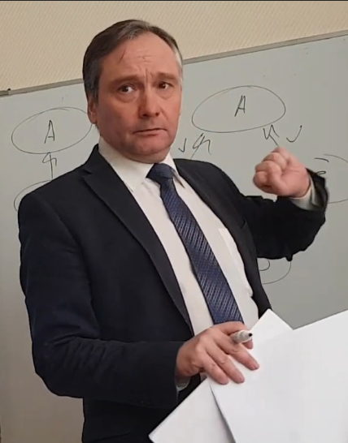

# C Programming Language. BMSTU, RK faculty, teacher: Tassov K. L.
Programming assignments for "C Programming" course (RK faculty) taught by Kirill Tassov from BMSTU.

### Short description

There is a nice guy, Tassov Kirill Leonidovich, who was my first lecturer in computer science. It was a great luck for me to find a list of the assignments which I've seen first time long time ago in ~2007. Thank you, Kirill Leonidovich, for your work and very-well structured course. It was a matter of honor to refresh some basic C syntax, solve some assignments and rememder your jokes. If you've ever seen this, I wish you a good health and all the best ever.

### Labs

Here you could find labs description and solutions provided by me.

1. [Point inside a triangle](./lab-01/lab-01.md)
2. [Simple functions](./lab-02/lab-02.md)
3. [Integral and derivative](./lab-03/lab-03.md)
4. [Basic 1D arrays](./lab-04/lab-04.md)
5. [1D array sorting](./lab-05/lab-05.md)
6. [Basic 2D arrays](./lab-06/lab-06.md)
7. [Matrix operations](./lab-07/lab-07.md)
8. [Basic strings](./lab-08/lab-08.md)
9. [String methods](./lab-09/lab-09.md)
10. [Array of strings](./lab-10/lab-10.md)
11. [Text files](./lab-11/lab-11.md)
12. [Binary files without loading to memory](./lab-12/lab-12.md)
13. [Database (working with multiple files)](./lab-13/lab-13.md)
